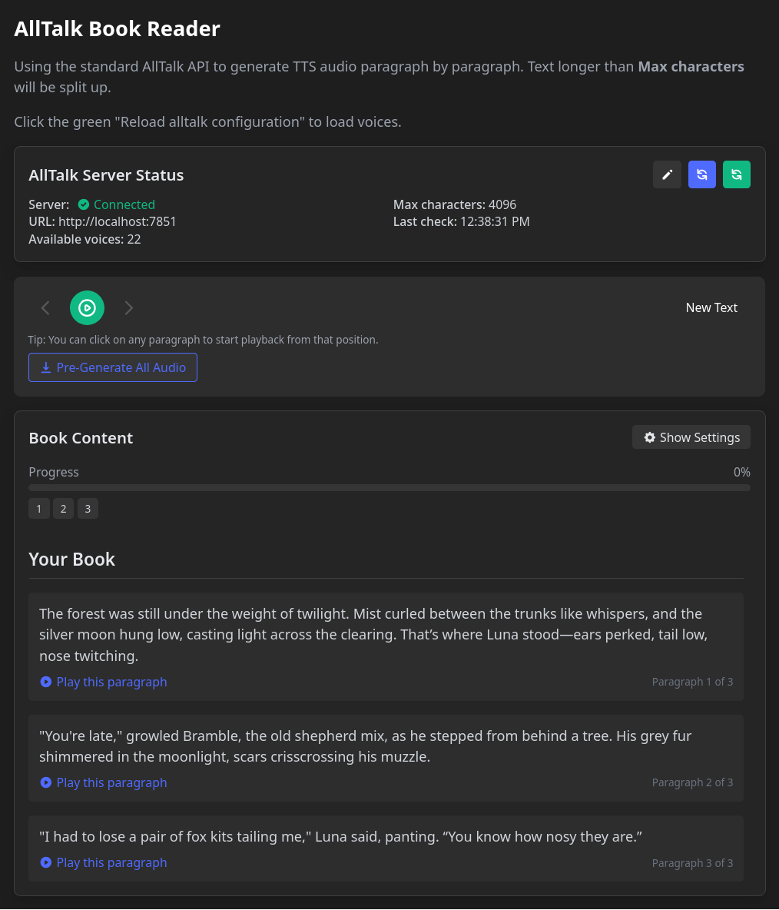

# AllTalk Reader

An audiobook reader application that uses the AllTalk API to convert text into speech. This was created for my personal use so that I didn't have to pay for software that does this.

## Overview

AllTalk Reader transforms any text into an audiobook with high-quality text-to-speech. Simply paste your text, choose a voice, adjust settings, and listen. The application automatically splits long text into paragraphs, tracks your reading position, and provides playback controls.

## Features

- **Dark Mode Interface**: Easy on the eyes for extended reading sessions
- **Text-to-Speech**: Uses AllTalk's API for high-quality voice synthesis
- **Multiple Voices**: Choose from various character voices
- **Customizable Playback**: Adjust speed, pitch, and language settings
- **Progress Tracking**: Easily track where you are in your text with visual indicators
- **Paragraph Navigation**: Jump between sections with a simple click
- **Batch Audio Generation**: Pre-generate audio for all paragraphs for a smoother experience
- **Auto-splitting**: Intelligently divides long text into manageable paragraphs

## Requirements

- Node.js 14+ and npm/pnpm
- AllTalk TTS server running (default: http://localhost:7851)

## Quick Start

1. Ensure your AllTalk server is running and accessible
2. Clone this repository
3. Install dependencies: `pnpm install`
4. Start the development server: `pnpm dev`
5. Access the application at: http://localhost:5173 (or the port shown in your terminal)

## Usage

1. Either paste your text in the input field
2. Click "Process Text" to split the text into paragraphs
3. Use the playback controls at the top to navigate through paragraphs
4. Click on any paragraph to start reading from that position
5. Adjust voice, speed, pitch, and language settings as desired
6. Optionally use "Pre-Generate All Audio" to cache the audio files for better performance

## Server Configuration

The application connects to AllTalk by default at `http://localhost:7851`. You can configure the connection settings by clicking the edit button in the Server Status section.

## Tips for Best Results

- Properly formatted text with paragraph breaks works best
- Pre-generate audio for longer texts to avoid waiting during playback

## Troubleshooting

- **Server Not Connected**: Ensure AllTalk is running and the correct IP/port is configured
- **Voice not working**: Verify that the selected voice exists on your AllTalk server
- **Audio playback issues**: Check your browser's audio settings and permissions.

