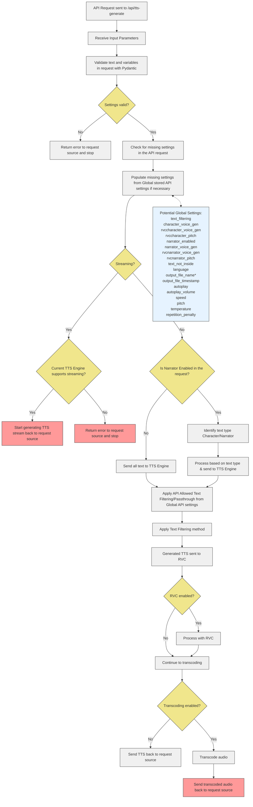

When integrating the AllTalk API into your project, following these best practices will help ensure smooth operation and optimal performance. Code examples for each type of API request can be found on the relevant API help pages.

## Storing Connection Information

At a minimum, you need to store the following information:

- IP address
- Port number

Optionally, you may want to store:

- HTTP/HTTPS protocol (if using AllTalk over tunnels)
- Connection timeout value

Example configuration:

```json
{
    "api_alltalk_protocol": "http://",
    "api_alltalk_ip_port": "127.0.0.1:7851",
    "api_connection_timeout": 5
}
```

## Startup Procedure

1. Connect to the IP/Port and check the `/api/ready` endpoint for a 'Ready' status.
2. Implement a loop to check for the duration of the connection timeout.
3. If the timeout is reached without a response, set voices, models, and other values as "Server Offline" or similar.

## Initial Setup

If the connection is available:

1. Pull current settings: `/api/currentsettings`
2. Pull available voices: `/api/voices`
3. Pull available RVC voices: `/api/rvcvoices`

## User Interface Considerations

- Present options based on the retrieved information.
- Respect the `xxxxxx_capable` settings from `/api/currentsettings`.
- Disable options in your UI that aren't supported by the current TTS engine.

## Refreshing Settings

Implement a refresh button to:

1. Make AllTalk update its settings: `/api/reload_config`
2. Pull current settings and voices again

This ensures users can reconnect to the AllTalk server if it's unavailable at startup or if settings have changed.

## Handling TTS Generation Requests

When sending requests to `/api/tts-generate`:

- If presenting all variables/options to the user, send all stored interface values.
- If not presenting all options:
  1. Send all values but hard-code some settings in your outbound request, or
  2. Only send required values and let AllTalk use default Global API settings for the rest.

## Saving Settings

Consider saving settings after each successful generation request to ensure valid settings and correct IP address/port.

## Error Handling

- Implement proper error handling for API responses.
- Display user-friendly error messages when API calls fail.
- Consider implementing a retry mechanism for temporary failures.

## Performance Optimization

- Cache frequently used data (e.g., available voices) to reduce API calls.
- Implement request throttling to avoid overwhelming the AllTalk server.
- Use streaming TTS generation for real-time applications when appropriate.

## Security Considerations

- If exposing AllTalk over the internet, use HTTPS and implement proper authentication.
- Validate and sanitize all user inputs before sending them to the API.
- Keep your AllTalk instance and client application up to date with the latest security patches.

## Code Example

Python code example, communicating with all endpoints.

```
import requests
import time
import json
from pprint import pprint

class AllTalkAPI:
    """
    A class to interact with the AllTalk API.
    This class provides methods to initialize the connection, fetch server information,
    and perform various operations like generating TTS, switching models, etc.
    """

    def __init__(self, config_file='config.json'):
        """
        Initialize the AllTalkAPI class.
        Loads configuration from a file or uses default values.
        Sets up the base URL for API requests and initializes variables for storing server data.
        """
        # Default configuration
        default_config = {
            "api_alltalk_protocol": "http://",
            "api_alltalk_ip_port": "127.0.0.1:7851",
            "api_connection_timeout": 5
        }
        
        # Try to load configuration from JSON file, use defaults if file not found
        try:
            with open(config_file, 'r') as f:
                self.config = json.load(f)
        except FileNotFoundError:
            print(f"Config file '{config_file}' not found. Using default configuration.")
            self.config = default_config
        
        # Construct the base URL for API requests
        self.base_url = f"{self.config['api_alltalk_protocol']}{self.config['api_alltalk_ip_port']}"
        
        # Initialize variables to store API data
        self.current_settings = None
        self.available_voices = None
        self.available_rvc_voices = None

    def check_server_ready(self):
        """
        Check if the AllTalk server is ready to accept requests.
        Attempts to connect to the server within the specified timeout period.
        Returns True if the server is ready, False otherwise.
        """
        timeout = time.time() + self.config['api_connection_timeout']
        while time.time() < timeout:
            try:
                response = requests.get(f"{self.base_url}/api/ready", timeout=1)
                if response.text == "Ready":
                    return True
            except requests.RequestException:
                pass
            time.sleep(0.5)
        return False

    def initialize(self):
        """
        Perform initial setup by fetching current settings and available voices.
        This method should be called after creating an instance of AllTalkAPI.
        Returns True if initialization is successful, False otherwise.
        """
        if not self.check_server_ready():
            print("Server is offline or not responding.")
            return False

        self.current_settings = self.get_current_settings()
        self.available_voices = self.get_available_voices()
        self.available_rvc_voices = self.get_available_rvc_voices()
        return True

    def get_current_settings(self):
        """
        Fetch current settings from the AllTalk server.
        Returns a dictionary of server settings or None if the request fails.
        """
        try:
            response = requests.get(f"{self.base_url}/api/currentsettings")
            response.raise_for_status()
            return response.json()
        except requests.RequestException as e:
            print(f"Error fetching current settings: {e}")
            return None

    def get_available_voices(self):
        """
        Fetch available voices from the AllTalk server.
        Returns a list of available voices or None if the request fails.
        """
        try:
            response = requests.get(f"{self.base_url}/api/voices")
            response.raise_for_status()
            data = response.json()
            return data.get('voices', [])
        except requests.RequestException as e:
            print(f"Error fetching available voices: {e}")
            return None

    def get_available_rvc_voices(self):
        """
        Fetch available RVC voices from the AllTalk server.
        RVC (Retrieval-based Voice Conversion) voices are used for voice cloning.
        Returns a list of available RVC voices or None if the request fails.
        """
        try:
            response = requests.get(f"{self.base_url}/api/rvcvoices")
            response.raise_for_status()
            data = response.json()
            return data.get('rvcvoices', [])
        except requests.RequestException as e:
            print(f"Error fetching available RVC voices: {e}")
            return None

    def reload_config(self):
        """
        Reload the AllTalk server configuration.
        This method triggers a config reload on the server and then re-initializes the local data.
        Returns True if the reload is successful, False otherwise.
        """
        response = requests.get(f"{self.base_url}/api/reload_config")
        if response.status_code == 200:
            # Re-fetch settings and voices after reloading config
            self.initialize()
            return True
        return False

    def generate_tts(self, text, character_voice, narrator_voice=None, **kwargs):
        """
        Generate text-to-speech audio using the AllTalk server.
        
        Args:
            text (str): The text to convert to speech.
            character_voice (str): The voice to use for the character.
            narrator_voice (str, optional): The voice to use for the narrator, if applicable.
            **kwargs: Additional parameters for TTS generation (e.g., language, output_file_name).
        
        Returns:
            dict: A dictionary containing information about the generated audio, or None if generation fails.
        """
        data = {
            "text_input": text,
            "character_voice_gen": character_voice,
            "narrator_enabled": "true" if narrator_voice else "false",
            "narrator_voice_gen": narrator_voice,
            **kwargs
        }
        response = requests.post(f"{self.base_url}/api/tts-generate", data=data)
        return response.json() if response.status_code == 200 else None

    def stop_generation(self):
        """
        Stop the current TTS generation process.
        Returns the server's response as a dictionary, or None if the request fails.
        """
        response = requests.put(f"{self.base_url}/api/stop-generation")
        return response.json() if response.status_code == 200 else None

    def switch_model(self, model_name):
        """
        Switch to a different TTS model.
        
        Args:
            model_name (str): The name of the model to switch to.
        
        Returns:
            dict: The server's response as a dictionary if successful, None if the request fails.
        """
        try:
            response = requests.post(f"{self.base_url}/api/reload", params={"tts_method": model_name})
            response.raise_for_status()  # This will raise an exception for HTTP errors
            return response.json()
        except requests.RequestException as e:
            print(f"Error switching model: {e}")
            if response.status_code == 404:
                print(f"Model '{model_name}' not found on the server.")
            elif response.status_code == 500:
                print("Server encountered an error while switching models.")
            else:
                print(f"Unexpected error occurred. Status code: {response.status_code}")
            return None

    def set_deepspeed(self, enabled):
        """
        Enable or disable DeepSpeed mode.
        DeepSpeed is an optimization library for large-scale models.
        
        Args:
            enabled (bool): True to enable DeepSpeed, False to disable.
        
        Returns:
            dict: The server's response as a dictionary, or None if the request fails.
        """
        response = requests.post(f"{self.base_url}/api/deepspeed", params={"new_deepspeed_value": str(enabled).lower()})
        return response.json() if response.status_code == 200 else None

    def set_low_vram(self, enabled):
        """
        Enable or disable Low VRAM mode.
        Low VRAM mode optimizes memory usage for systems with limited GPU memory.
        
        Args:
            enabled (bool): True to enable Low VRAM mode, False to disable.
        
        Returns:
            dict: The server's response as a dictionary, or None if the request fails.
        """
        response = requests.post(f"{self.base_url}/api/lowvramsetting", params={"new_low_vram_value": str(enabled).lower()})
        return response.json() if response.status_code == 200 else None

    def display_server_info(self):
        """
        Display all information pulled from the AllTalk server.
        This includes current settings, available voices, RVC voices, and server capabilities.
        """
        print("=== AllTalk Server Information ===")
        
        print(f"\nServer URL: {self.base_url}")
        
        print("\n--- Current Settings ---")
        pprint(self.current_settings)
        
        print("\n--- Available Voices ---")
        pprint(self.available_voices)
        
        print("\n--- Available RVC Voices ---")
        pprint(self.available_rvc_voices)
        
        print("\n--- Server Capabilities ---")
        if self.current_settings:
            capabilities = {
                "DeepSpeed Capable": self.current_settings.get('deepspeed_capable', False),
                "DeepSpeed Enabled": self.current_settings.get('deepspeed_enabled', False),
                "Low VRAM Capable": self.current_settings.get('lowvram_capable', False),
                "Low VRAM Enabled": self.current_settings.get('lowvram_enabled', False),
                "Generation Speed Capable": self.current_settings.get('generationspeed_capable', False),
                "Current Generation Speed": self.current_settings.get('generationspeed_set', 'N/A'),
                "Pitch Capable": self.current_settings.get('pitch_capable', False),
                "Current Pitch": self.current_settings.get('pitch_set', 'N/A'),
                "Temperature Capable": self.current_settings.get('temperature_capable', False),
                "Current Temperature": self.current_settings.get('temperature_set', 'N/A'),
                "Streaming Capable": self.current_settings.get('streaming_capable', False),
                "Multi-voice Capable": self.current_settings.get('multivoice_capable', False),
                "Multi-model Capable": self.current_settings.get('multimodel_capable', False),
                "Languages Capable": self.current_settings.get('languages_capable', False)
            }
            pprint(capabilities)
        else:
            print("Server settings not available. Make sure the server is running and accessible.")

# Example usage
if __name__ == "__main__":
    # Create an instance of the AllTalkAPI
    api = AllTalkAPI()
    
    # Initialize the API and fetch server information
    if api.initialize():
        print("AllTalk API initialized successfully.")
        
        # Display all server information
        api.display_server_info()
        
        # Generate TTS
        result = api.generate_tts(
            "Hello, this is a test.",
            character_voice="female_01.wav",
            language="en",
            output_file_name="test_output"
        )
        if result:
            print(f"\nTTS generated: {result['output_file_url']}")
        else:
            print("Failed to generate TTS.")
        
        # Switch to a different TTS model
        print("\nAttempting to switch TTS model...")
        available_models = api.current_settings.get('models_available', [])
        if available_models:
            target_model = available_models[0]['name']  # Choose the first available model
            if api.switch_model(target_model):
                print(f"Model switched successfully to {target_model}.")
            else:
                print(f"Failed to switch to model {target_model}.")
        else:
            print("No available models found. Cannot switch model.")
        
        # Enable DeepSpeed for optimized performance
        if api.set_deepspeed(True):
            print("DeepSpeed enabled.")
        else:
            print("Failed to enable DeepSpeed.")
        
        # Reload config and display updated information
        if api.reload_config():
            print("\nConfiguration reloaded. Updated server information:")
            api.display_server_info()
        else:
            print("Failed to reload configuration.")
    else:
        print("Failed to initialize AllTalk API.")
```This set of endpoints allows you to control various aspects of the AllTalk server, including stopping generation, reloading configurations, switching models, and adjusting performance settings.

## 1. Stop Generation Endpoint

Interrupt the current TTS generation process, if the currently loaded TTS engine & method supports it. Currently only XTTS Streaming supports this.

- **URL**: `http://{ipaddress}:{port}/api/stop-generation`
- **Method**: `PUT`

### Response

```json
{
    "message": "Cancelling current TTS generation"
}
```

### Example Request

```bash
curl -X PUT "http://127.0.0.1:7851/api/stop-generation"
```

### Notes
- This sets `tts_stop_generation` in the model_engine to True.
- Stop requests will only be honored if the current TTS engine is capable of handling and can honor a stop request partway through generation.

## 2. Reload Configuration Endpoint

Reload the TTS engine's configuration and scan for new voices and models.

- **URL**: `http://{ipaddress}:{port}/api/reload_config`
- **Method**: `GET`

### Response

```
Config file reloaded successfully
```

### Example Request

```bash
curl -X GET "http://127.0.0.1:7851/api/reload_config"
```

### Notes
- This ensures that subsequent calls to `/api/currentsettings`, `/api/voices`, and `/api/rvcvoices` return up-to-date information.

## 3. Reload/Swap Model Endpoint

Load or swap to one of the models presented by `/api/currentsettings` in the `models_available` list.

- **URL**: `http://{ipaddress}:{port}/api/reload`
- **Method**: `POST`

### Parameters

| Parameter | Type | Description |
|-----------|------|-------------|
| `tts_method` | string | The name of the model to load |

### Response

```json
{"status": "model-success"}
```
or
```json
{"status": "model-failure"}
```

### Example Request

```bash
curl -X POST "http://127.0.0.1:7851/api/reload?tts_method=xtts%20-%20xttsv2_2.0.2"
```

## 4. Switch DeepSpeed Endpoint

Enable or disable DeepSpeed mode, is the currently loaded TTS engine supports it.

- **URL**: `http://{ipaddress}:{port}/api/deepspeed`
- **Method**: `POST`

### Parameters

| Parameter | Type | Description |
|-----------|------|-------------|
| `new_deepspeed_value` | boolean | `True` to enable DeepSpeed, `False` to disable |

### Response

```json
{
    "status": "deepspeed-success"
}
```

### Example Request

```bash
curl -X POST "http://127.0.0.1:7851/api/deepspeed?new_deepspeed_value=True"
```

## 5. Switch Low VRAM Endpoint

Enable or disable Low VRAM mode. Will only benefit TTS Engines that support CUDA.

- **URL**: `http://{ipaddress}:{port}/api/lowvramsetting`
- **Method**: `POST`

### Parameters

| Parameter | Type | Description |
|-----------|------|-------------|
| `new_low_vram_value` | boolean | `True` to enable Low VRAM mode, `False` to disable |

### Response

```json
{
    "status": "lowvram-success"
}
```

### Example Request

```bash
curl -X POST "http://127.0.0.1:7851/api/lowvramsetting?new_low_vram_value=True"
```

## Usage Tips

1. Use the Stop Generation endpoint when you need to cancel an ongoing TTS generation process.
2. The Reload Configuration endpoint is useful after making changes to the AllTalk configuration or adding new voice models.
3. Use the Reload/Swap Model endpoint to change the active TTS model dynamically.
4. The DeepSpeed and Low VRAM endpoints allow you to adjust performance settings based on your system's capabilities and current needs.
5. Always check the response status to ensure your configuration changes were applied successfully.
6. After making configuration changes, it's a good practice to use the status endpoints (from the AllTalk Server and TTS Engine Status API) to verify the new state of the server.

## Code Examples

#### Python Example

```python
import requests

# Base URL for the API
BASE_URL = "http://127.0.0.1:7851/api"

def stop_generation():
    """Stop the current TTS generation process."""
    response = requests.put(f"{BASE_URL}/stop-generation")
    print(response.json())

def reload_config():
    """Reload the TTS engine's configuration."""
    response = requests.get(f"{BASE_URL}/reload_config")
    print(response.text)

def reload_model(tts_method):
    """Load or swap to a specific TTS model."""
    params = {"tts_method": tts_method}
    response = requests.post(f"{BASE_URL}/reload", params=params)
    print(response.json())

def switch_deepspeed(enable):
    """Enable or disable DeepSpeed mode."""
    params = {"new_deepspeed_value": str(enable).lower()}
    response = requests.post(f"{BASE_URL}/deepspeed", params=params)
    print(response.json())

def switch_low_vram(enable):
    """Enable or disable Low VRAM mode."""
    params = {"new_low_vram_value": str(enable).lower()}
    response = requests.post(f"{BASE_URL}/lowvramsetting", params=params)
    print(response.json())

# Example usage
if __name__ == "__main__":
    stop_generation()
    reload_config()
    reload_model("xtts - xttsv2_2.0.2")
    switch_deepspeed(True)
    switch_low_vram(True)

# Note: Replace the BASE_URL with the correct IP address and port if different from the default
# Error handling can be improved for production use
```

#### JavaScript Example
```javascript
// Base URL for the API
const BASE_URL = "http://127.0.0.1:7851/api";

async function stopGeneration() {
    const response = await fetch(`${BASE_URL}/stop-generation`, { method: 'PUT' });
    console.log(await response.json());
}

async function reloadConfig() {
    const response = await fetch(`${BASE_URL}/reload_config`);
    console.log(await response.text());
}

async function reloadModel(ttsMethod) {
    const params = new URLSearchParams({ tts_method: ttsMethod });
    const response = await fetch(`${BASE_URL}/reload?${params}`, { method: 'POST' });
    console.log(await response.json());
}

async function switchDeepspeed(enable) {
    const params = new URLSearchParams({ new_deepspeed_value: enable });
    const response = await fetch(`${BASE_URL}/deepspeed?${params}`, { method: 'POST' });
    console.log(await response.json());
}

async function switchLowVRAM(enable) {
    const params = new URLSearchParams({ new_low_vram_value: enable });
    const response = await fetch(`${BASE_URL}/lowvramsetting?${params}`, { method: 'POST' });
    console.log(await response.json());
}

// Example usage
async function runExamples() {
    try {
        await stopGeneration();
        await reloadConfig();
        await reloadModel("xtts - xttsv2_2.0.2");
        await switchDeepspeed(true);
        await switchLowVRAM(true);
    } catch (error) {
        console.error("An error occurred:", error);
    }
}

runExamples();

// Note: Replace the BASE_URL with the correct IP address and port if different from the default
// This example uses async/await for better readability, but you can also use .then() chains if preferred
// Error handling can be improved for production use
// For browser usage, ensure CORS is properly configured on the server side
```
AllTalk provides an endpoint compatible with the OpenAI Speech v1 API. This allows for easy integration with existing systems designed to work with OpenAI's text-to-speech service.

- [Endpoint Details](#endpoint-details)  

- [Voice Remapping](#voice-remapping)  
- [Code Examples](#code-examples)  

## Endpoint Details

- **URL**: `http://{ipaddress}:{port}/v1/audio/speech`
- **Method**: `POST`
- **Content-Type**: `application/json`

## Request Format

The request body must be a JSON object with the following fields:

| Field | Type | Description |
|-------|------|-------------|
| `model` | string | The TTS model to use. Currently ignored, but required in the request. |
| `input` | string | The text to generate audio for. Maximum length is 4096 characters. |
| `voice` | string | The voice to use when generating the audio. |
| `response_format` | string | (Optional) The format of the audio. Audio will be transcoded to the requested format. |
| `speed` | float | (Optional) The speed of the generated audio. Must be between 0.25 and 4.0. Default is 1.0. |

### Supported Voices

The `voice` parameter supports the following values:

- `alloy`
- `echo`
- `fable`
- `nova`
- `onyx`
- `shimmer`

These voices are mapped to AllTalk voices on a one-to-one basis within the AllTalk Gradio interface, on a per-TTS engine basis.

## Example cURL Request

```bash
curl -X POST "http://127.0.0.1:7851/v1/audio/speech" \
     -H "Content-Type: application/json" \
     -d '{
           "model": "any_model_name",
           "input": "Hello, this is a test.",
           "voice": "nova",
           "response_format": "wav",
           "speed": 1.0
         }'
```

## Response

The endpoint returns the generated audio data directly in the response body.

## Additional Notes

- There is no capability within this API to specify a language. The response will be in whatever language the currently loaded TTS engine and model support.
- If RVC is globally enabled in AllTalk settings and a voice other than "Disabled" is selected for the character voice, the chosen RVC voice will be applied after the TTS is generated and before the audio is transcoded and sent back out.

## Voice Remapping

Voices can be re-mapped in the **Gradio Interface**  > **TTS Engine Settings** > {Chosen TTS Engine} > **OpenAI Voice Mappings**.

You can also remap the 6 OpenAI voices to any voices supported by the currently loaded TTS engine using the following endpoint:

- **URL**: `http://{ipaddress}:{port}/api/openai-voicemap`
- **Method**: `PUT`
- **Content-Type**: `application/json`

### Example Voice Remapping Request

```bash
curl -X PUT "http://localhost:7851/api/openai-voicemap" \
     -H "Content-Type: application/json" \
     -d '{
           "alloy": "female_01.wav",
           "echo": "female_01.wav",
           "fable": "female_01.wav",
           "nova": "female_01.wav",
           "onyx": "male_01.wav",
           "shimmer": "male_02.wav"
         }'
```

Note: The Gradio interface will not reflect these changes until AllTalk is reloaded, as Gradio caches the list.

## Code Examples

### Python Example

```python
import requests
import json

# Define the endpoint URL
url = "http://127.0.0.1:7851/v1/audio/speech"

# Define the request payload
payload = {
    "model": "any_model_name",
    "input": "Hello, this is a test.",
    "voice": "nova",
    "response_format": "wav",
    "speed": 1.0
}

# Set the headers
headers = {
    "Content-Type": "application/json"
}

# Send the POST request
response = requests.post(url, data=json.dumps(payload), headers=headers)

# Check the response
if response.status_code == 200:
    with open("output.wav", "wb") as f:
        f.write(response.content)
    print("Audio file saved as output.wav")
else:
    print(f"Error: {response.status_code} - {response.text}")
```

### JavaScript Example

```javascript
// Define the endpoint URL
const url = "http://127.0.0.1:7851/v1/audio/speech";

// Define the request payload
const payload = {
    model: "any_model_name",
    input: "Hello, this is a test.",
    voice: "nova",
    response_format: "wav",
    speed: 1.0
};

// Set the headers
const headers = {
    "Content-Type": "application/json"
};

// Send the POST request
fetch(url, {
    method: "POST",
    headers: headers,
    body: JSON.stringify(payload)
})
.then(response => {
    if (response.ok) {
        return response.blob();
    } else {
        return response.text().then(text => { throw new Error(text); });
    }
})
.then(blob => {
    // Create a link element
    const url = window.URL.createObjectURL(blob);
    const a = document.createElement('a');
    a.style.display = 'none';
    a.href = url;
    a.download = 'output.wav';

    // Append the link to the body
    document.body.appendChild(a);

    // Programmatically click the link to trigger the download
    a.click();

    // Remove the link from the document
    window.URL.revokeObjectURL(url);
    document.body.removeChild(a);

    console.log("Audio file saved as output.wav");
})
.catch(error => {
    console.error("Error:", error);
});
```

These examples demonstrate how to use the OpenAI V1 API Compatible Endpoint with AllTalk in both Python and JavaScript environments.This set of endpoints allows you to retrieve information about the current state of the AllTalk server and its loaded TTS engine, including available voices, settings, and server readiness.

## 1. Server Ready Status Endpoint

Check if the Text-to-Speech (TTS) engine has started and is ready to accept requests.

- **URL**: `http://{ipaddress}:{port}/api/ready`
- **Method**: `GET`

### Response

| Status | Description |
|--------|-------------|
| `Ready` | The TTS engine is ready to process requests. |
| `Unloaded` | The TTS engine is restarting or not ready. |

### Example Request

```bash
curl -X GET "http://127.0.0.1:7851/api/ready"
```

### Notes
- Useful when performing reload model/engine requests.
- You can poll this endpoint to confirm a "Ready" status.
- A "Ready" status only indicates that the engine has loaded, not that all models are correctly loaded.

## 2. Standard Voices List Endpoint

Retrieve a list of available voices for the currently loaded TTS engine and model.

- **URL**: `http://{ipaddress}:{port}/api/voices`
- **Method**: `GET`

### Response

```json
{
    "status": "success",
    "voices": ["voice1", "voice2", "voice3"]
}
```

### Example Request

```bash
curl -X GET "http://127.0.0.1:7851/api/voices"
```

### Notes
- If the currently loaded TTS engine does not load a model directly (e.g., Piper), the models themselves will be displayed as voices.

## 3. RVC Voices List Endpoint

Retrieve a list of available RVC voices for further processing your TTS with the RVC pipeline. If RVC is disabled on the server or there are no available voices, the voice returned will just be "Disabled". "Disabled" will always be added as a voice to the list, even if RVC is enabled on the server. This way Disabled can be chosen as a voice to bypass RVC processing, even when RVC is enabled server side.

- **URL**: `http://{ipaddress}:{port}/api/rvcvoices`
- **Method**: `GET`

### Response

```json
{
    "status": "success",
    "voices": ["Disabled", "folder1\\voice1.pth", "folder2\\voice2.pth", "folder3\\voice3.pth"]
}
```

### Example Request

```bash
curl -X GET "http://127.0.0.1:7851/api/rvcvoices"
```

### Notes
- `Disabled` will always be included in the list.
- If the RVC pipeline is globally disabled in AllTalk, `Disabled` will be the only item in the list.
- Index files matching their RVC voices will not be displayed; if an index file exists for an RVC voice, it will be automatically selected during generation.

## 4. Current Settings Endpoint

Retrieve the current settings of the currently loaded TTS engine.

- **URL**: `http://{ipaddress}:{port}/api/currentsettings`
- **Method**: `GET`

### Response

The response is a JSON object containing various settings. Here are some key fields:

| Field | Description |
|-------|-------------|
| `engines_available` | List of available TTS engines that can be loaded |
| `current_engine_loaded` | The currently loaded TTS engine |
| `models_available` | List of available models for the current TTS engine |
| `current_model_loaded` | The currently loaded model |
| `manufacturer_name` | The manufacturer of the current TTS engine |
| `audio_format` | The primary format in which the current engine produces audio output |
| `deepspeed_capable` | Whether the current TTS engine supports DeepSpeed |
| `generationspeed_capable` | Whether the current TTS engine supports generating TTS at different speeds |
| `pitch_capable` | Whether the current TTS engine supports generating TTS at different pitches |
| `temperature_capable` | Whether the current TTS engine supports different temperature settings |
| `languages_capable` | Whether the models within the current TTS engine support multiple languages |
| `multivoice_capable` | Whether the current model supports multiple voices |
| `multimodel_capable` | Whether the current TTS engine uses models as voices |

### Example Request

```bash
curl -X GET "http://127.0.0.1:7851/api/currentsettings"
```

```
{
"engines_available": ["parler", "piper", "vits", "xtts"],
"current_engine_loaded": "xtts",
"models_available": [
    {"name": "xtts - xttsv2_2.0.2"},
    {"name": "apitts - xttsv2_2.0.2"},
    {"name": "xtts - xttsv2_2.0.3"},
    {"name": "apitts - xttsv2_2.0.3"}
],
"current_model_loaded": "xtts - xttsv2_2.0.3",
"manufacturer_name": "Coqui",
"audio_format": "wav",
"deepspeed_capable": true,
"deepspeed_available": true,
"deepspeed_enabled": true,
"generationspeed_capable": true,
"generationspeed_set": 1,
"lowvram_capable": true,
"lowvram_enabled": false,
"pitch_capable": false,
"pitch_set": 0,
"repetitionpenalty_capable": true,
"repetitionpenalty_set": 10,
"streaming_capable": true,
"temperature_capable": true,
"temperature_set": 0.75,
"ttsengines_installed": true,
"languages_capable": true,
"multivoice_capable": true,
"multimodel_capable": true
}
```


### Notes
- The response includes many more fields detailing the capabilities and current settings of the loaded TTS engine.
- Use this endpoint to dynamically adjust your application's UI based on the current capabilities of the loaded TTS engine.

## Usage Tips

1. Check the server readiness before making other API calls.
2. Use the voices and RVC voices endpoints to populate selection menus in your application.
3. Use the current settings endpoint to adjust your application's features based on the capabilities of the loaded TTS engine.
4. Regularly poll these endpoints if you need to maintain an up-to-date status of the AllTalk server in a long-running application.

## Code Examples

#### Python Example

```python
import requests

# Base URL for the API
BASE_URL = "http://127.0.0.1:7851/api"

def stop_generation():
    """Stop the current TTS generation process."""
    response = requests.put(f"{BASE_URL}/stop-generation")
    print(response.json())

def reload_config():
    """Reload the TTS engine's configuration."""
    response = requests.get(f"{BASE_URL}/reload_config")
    print(response.text)

def reload_model(tts_method):
    """Load or swap to a specific TTS model."""
    params = {"tts_method": tts_method}
    response = requests.post(f"{BASE_URL}/reload", params=params)
    print(response.json())

def switch_deepspeed(enable):
    """Enable or disable DeepSpeed mode."""
    params = {"new_deepspeed_value": str(enable).lower()}
    response = requests.post(f"{BASE_URL}/deepspeed", params=params)
    print(response.json())

def switch_low_vram(enable):
    """Enable or disable Low VRAM mode."""
    params = {"new_low_vram_value": str(enable).lower()}
    response = requests.post(f"{BASE_URL}/lowvramsetting", params=params)
    print(response.json())

# Example usage
if __name__ == "__main__":
    stop_generation()
    reload_config()
    reload_model("xtts - xttsv2_2.0.2")
    switch_deepspeed(True)
    switch_low_vram(True)

# Note: Replace the BASE_URL with the correct IP address and port if different from the default
# Error handling can be improved for production use
```

#### JavaScript Example
```javascript
// Base URL for the API
const BASE_URL = "http://127.0.0.1:7851/api";

async function stopGeneration() {
    const response = await fetch(`${BASE_URL}/stop-generation`, { method: 'PUT' });
    console.log(await response.json());
}

async function reloadConfig() {
    const response = await fetch(`${BASE_URL}/reload_config`);
    console.log(await response.text());
}

async function reloadModel(ttsMethod) {
    const params = new URLSearchParams({ tts_method: ttsMethod });
    const response = await fetch(`${BASE_URL}/reload?${params}`, { method: 'POST' });
    console.log(await response.json());
}

async function switchDeepspeed(enable) {
    const params = new URLSearchParams({ new_deepspeed_value: enable });
    const response = await fetch(`${BASE_URL}/deepspeed?${params}`, { method: 'POST' });
    console.log(await response.json());
}

async function switchLowVRAM(enable) {
    const params = new URLSearchParams({ new_low_vram_value: enable });
    const response = await fetch(`${BASE_URL}/lowvramsetting?${params}`, { method: 'POST' });
    console.log(await response.json());
}

// Example usage
async function runExamples() {
    try {
        await stopGeneration();
        await reloadConfig();
        await reloadModel("xtts - xttsv2_2.0.2");
        await switchDeepspeed(true);
        await switchLowVRAM(true);
    } catch (error) {
        console.error("An error occurred:", error);
    }
}

runExamples();

// Note: Replace the BASE_URL with the correct IP address and port if different from the default
// This example uses async/await for better readability, but you can also use .then() chains if preferred
// Error handling can be improved for production use
// For browser usage, ensure CORS is properly configured on the server side
```This endpoint allows you to generate Text-to-Speech (TTS) audio based on text input. It supports both character and narrator speech generation.

To understand how tts requests to this endpoint flow through AllTalk V2, please see the [flowchart here](https://github.com/erew123/alltalk_tts/wiki/API-%E2%80%90-TTS-Request-Flowchart)

## Endpoint Details

- **URL**: `http://{ipaddress}:{port}/api/tts-generate`
- **Method**: `POST`
- **Content-Type**: `application/x-www-form-urlencoded`

## Request Parameters

| Parameter | Type | Description |
|-----------|------|-------------|
| `text_input` | string | The text you want the TTS engine to produce. |
| `text_filtering` | string | Filter for text. Options: `none`, `standard`, `html` |
| `character_voice_gen` | string | The name of the character's voice file (WAV format). |
| `rvccharacter_voice_gen` | string | The name of the RVC voice file for the character. Format: `folder\file.pth` or `Disabled` |
| `rvccharacter_pitch` | integer | The pitch for the RVC voice for the character. Range: -24 to 24 |
| `narrator_enabled` | boolean | Enable or disable the narrator function. |
| `narrator_voice_gen` | string | The name of the narrator's voice file (WAV format). |
| `rvcnarrator_voice_gen` | string | The name of the RVC voice file for the narrator. Format: `folder\file.pth` or `Disabled` |
| `rvcnarrator_pitch` | integer | The pitch for the RVC voice for the narrator. Range: -24 to 24 |
| `text_not_inside` | string | Specify handling of lines not inside quotes or asterisks. Options: `character`, `narrator`, `silent` |
| `language` | string | Choose the language for TTS or use `auto` for auto detection. (See supported languages below) |
| `output_file_name` | string | The name of the output file (excluding the .wav extension). |
| `output_file_timestamp` | boolean | Add a timestamp to the output file name. |
| `autoplay` | boolean | Enable or disable playing the generated TTS to your standard sound output device at the Terminal/Command prompt window. |
| `autoplay_volume` | float | Set the autoplay volume. Range: 0.1 to 1.0 |
| `speed` | float | Set the speed of the generated audio. Range: 0.25 to 2.0 |
| `pitch` | integer | Set the pitch of the generated audio. Range: -10 to 10 |
| `temperature` | float | Set the temperature for the TTS engine. Range: 0.1 to 1.0 |
| `repetition_penalty` | float | Set the repetition penalty for the TTS engine. Range: 1.0 to 20.0 |

### Supported Languages

| Code | Language |
|------|----------|
| `auto` | Auto detect language |
| `ar` | Arabic |
| `zh-cn` | Chinese (Simplified) |
| `cs` | Czech |
| `nl` | Dutch |
| `en` | English |
| `fr` | French |
| `de` | German |
| `hi` | Hindi (limited support) |
| `hu` | Hungarian |
| `it` | Italian |
| `ja` | Japanese |
| `ko` | Korean |
| `pl` | Polish |
| `pt` | Portuguese |
| `ru` | Russian |
| `es` | Spanish |
| `tr` | Turkish |

## Example Requests

### Standard TTS Speech Example

Generate a time-stamped file for standard text and play the audio at the command prompt/terminal:

```bash
curl -X POST "http://127.0.0.1:7851/api/tts-generate" \
     -d "text_input=All of this is text spoken by the character. This is text not inside quotes, though that doesnt matter in the slightest" \
     -d "text_filtering=standard" \
     -d "character_voice_gen=female_01.wav" \
     -d "narrator_enabled=false" \
     -d "narrator_voice_gen=male_01.wav" \
     -d "text_not_inside=character" \
     -d "language=en" \
     -d "output_file_name=myoutputfile" \
     -d "output_file_timestamp=true" \
     -d "autoplay=false" \
     -d "autoplay_volume=0.8"
```

### Narrator Example

Generate a time-stamped file for text with narrator and character speech and play the audio at the command prompt/terminal:

```bash
curl -X POST "http://127.0.0.1:7851/api/tts-generate" \
     -d "text_input=*This is text spoken by the narrator* \"This is text spoken by the character\". This is text not inside quotes." \
     -d "text_filtering=standard" \
     -d "character_voice_gen=female_01.wav" \
     -d "narrator_enabled=true" \
     -d "narrator_voice_gen=male_01.wav" \
     -d "text_not_inside=character" \
     -d "language=en" \
     -d "output_file_name=myoutputfile" \
     -d "output_file_timestamp=true" \
     -d "autoplay=false" \
     -d "autoplay_volume=0.8"
```

Note: If your text contains double quotes, escape them with \\" (see the narrator example).

## Minimal Request Example

You can send a request with any mix of settings you wish. Missing fields will be populated using default API Global settings and default TTS engine settings:

```bash
curl -X POST "http://127.0.0.1:7851/api/tts-generate" \
     -d "text_input=All of this is text spoken by the character. This is text not inside quotes, though that doesnt matter in the slightest"
```

## Response

The API returns a JSON object with the following properties:

| Property | Description |
|----------|-------------|
| `status` | Indicates whether the generation was successful (`generate-success`) or failed (`generate-failure`). |
| `output_file_path` | The on-disk location of the generated WAV file. |
| `output_file_url` | The HTTP location for accessing the generated WAV file for browser playback. |
| `output_cache_url` | The HTTP location for accessing the generated WAV file as a pushed download. |

Example response:

```json
{
    "status": "generate-success",
    "output_file_path": "C:\\text-generation-webui\\extensions\\alltalk_tts\\outputs\\myoutputfile_1704141936.wav",
    "output_file_url": "/audio/myoutputfile_1704141936.wav",
    "output_cache_url": "/audiocache/myoutputfile_1704141936.wav"
}
```

Note: The response no longer includes the IP address and port number. You will need to add these in your own software/extension.

## Additional Notes

- All global settings for the API endpoint can be configured within the AllTalk interface under Global Settings > AllTalk API Defaults.
- TTS engine-specific settings, such as voices to use or engine parameters, can be set on an engine-by-engine basis in TTS Engine Settings > TTS Engine of your choice.
- Although you can send all variables/settings, the loaded TTS engine will only support them if it is capable. For example, you can request a TTS generation in Russian, but if the TTS model that is loaded only supports English, it will only generate English-sounding text-to-speech.
- Voices sent in the request have to match the voices available within the TTS engine loaded. Generation requests where the voices don't match will result in nothing being generated and possibly an error message.

## Code Examples

#### Python Example
```
import requests
import json

# API endpoint
API_URL = "http://127.0.0.1:7851/api/tts-generate"

# Function to generate TTS
def generate_tts(text, character_voice, narrator_voice=None, language="en", output_file="output", autoplay=False):
    # Prepare the payload
    payload = {
        "text_input": text,
        "text_filtering": "standard",
        "character_voice_gen": character_voice,
        "narrator_enabled": "true" if narrator_voice else "false",
        "narrator_voice_gen": narrator_voice if narrator_voice else "",
        "text_not_inside": "character",
        "language": language,
        "output_file_name": output_file,
        "output_file_timestamp": "true",
        "autoplay": str(autoplay).lower(),
        "autoplay_volume": "0.8"
    }

    # Send POST request to the API
    response = requests.post(API_URL, data=payload)

    # Check if the request was successful
    if response.status_code == 200:
        result = json.loads(response.text)
        if result["status"] == "generate-success":
            print(f"TTS generated successfully!")
            print(f"File path: {result['output_file_path']}")
            print(f"File URL: {result['output_file_url']}")
            print(f"Cache URL: {result['output_cache_url']}")
        else:
            print("TTS generation failed.")
    else:
        print(f"Error: {response.status_code} - {response.text}")

# Example usage
if __name__ == "__main__":
    text = "Hello, this is a test of the TTS API. *This part is narrated.* \"And this is spoken by a character.\""
    character_voice = "female_01.wav"
    narrator_voice = "male_01.wav"

    generate_tts(text, character_voice, narrator_voice)

# Note: Make sure to replace the API_URL with the correct IP address and port if different from the default
# You can customize the payload further by adding more parameters as needed (e.g., pitch, speed, temperature)
# Error handling can be improved for production use
```

#### Javascript Example
```
// API endpoint
const API_URL = "http://127.0.0.1:7851/api/tts-generate";

// Function to generate TTS
async function generateTTS(text, characterVoice, narratorVoice = null, language = "en", outputFile = "output", autoplay = false) {
    // Prepare the payload
    const payload = new URLSearchParams({
        text_input: text,
        text_filtering: "standard",
        character_voice_gen: characterVoice,
        narrator_enabled: narratorVoice ? "true" : "false",
        narrator_voice_gen: narratorVoice || "",
        text_not_inside: "character",
        language: language,
        output_file_name: outputFile,
        output_file_timestamp: "true",
        autoplay: autoplay.toString(),
        autoplay_volume: "0.8"
    });

    try {
        // Send POST request to the API
        const response = await fetch(API_URL, {
            method: 'POST',
            body: payload,
            headers: {
                'Content-Type': 'application/x-www-form-urlencoded',
            },
        });

        if (!response.ok) {
            throw new Error(`HTTP error! status: ${response.status}`);
        }

        const result = await response.json();

        if (result.status === "generate-success") {
            console.log("TTS generated successfully!");
            console.log(`File path: ${result.output_file_path}`);
            console.log(`File URL: ${result.output_file_url}`);
            console.log(`Cache URL: ${result.output_cache_url}`);
            return result;
        } else {
            console.error("TTS generation failed.");
            return null;
        }
    } catch (error) {
        console.error("Error:", error);
        return null;
    }
}

// Example usage
const text = "Hello, this is a test of the TTS API. *This part is narrated.* \"And this is spoken by a character.\"";
const characterVoice = "female_01.wav";
const narratorVoice = "male_01.wav";

generateTTS(text, characterVoice, narratorVoice)
    .then(result => {
        if (result) {
            // Handle successful generation, e.g., play audio or update UI
        }
    });

// Note: Make sure to replace the API_URL with the correct IP address and port if different from the default
// You can customize the payload further by adding more parameters as needed (e.g., pitch, speed, temperature)
// This example uses async/await for better readability, but you can also use .then() chains if preferred
// Error handling can be improved for production use
// For browser usage, ensure CORS is properly configured on the server side
```
This endpoint allows you to generate and stream TTS audio directly for real-time playback. It does not support narration and will generate an audio stream, not a file. It also does not support the RVC pipeline.

Only TTS engines that can support streaming can stream audio e.g. Coqui XTTS supports streaming.

## Endpoint Details

- **URL**: `http://{ipaddress}:{port}/api/tts-generate-streaming`
- **Method**: `POST`
- **Content-Type**: `application/x-www-form-urlencoded`

## Request Parameters

| Parameter | Type | Description |
|-----------|------|-------------|
| `text` | string | The text to convert to speech. |
| `voice` | string | The voice type to use. |
| `language` | string | The language for the TTS. |
| `output_file` | string | The name of the output file. |

## Example Request

```bash
curl -X POST "http://127.0.0.1:7851/api/tts-generate-streaming" \
     -d "text=Here is some text" \
     -d "voice=female_01.wav" \
     -d "language=en" \
     -d "output_file=stream_output.wav"
```

## Response

The endpoint returns a StreamingResponse for the audio stream.

The API also returns a JSON object with the following property:

| Property | Description |
|----------|-------------|
| `output_file_path` | The name of the output file. |

Example response:

```json
{
    "output_file_path": "stream_output.wav"
}
```

## JavaScript Example for Streaming Playback

Here's an example of how to use the streaming endpoint in JavaScript for real-time audio playback:

```javascript
const text = "Here is some text";
const voice = "female_01.wav";
const language = "en";
const outputFile = "stream_output.wav";
const encodedText = encodeURIComponent(text);
const streamingUrl = `http://localhost:7851/api/tts-generate-streaming?text=${encodedText}&voice=${voice}&language=${language}&output_file=${outputFile}`;
const audioElement = new Audio(streamingUrl);
audioElement.play();
```

## Additional Notes

1. **No Narration Support**: This endpoint does not support the narrator function available in the standard TTS generation endpoint.

2. **No RVC Pipeline**: The streaming endpoint does not support the RVC (Real-time Voice Conversion) pipeline.

3. **Real-time Playback**: This endpoint is designed for scenarios where you need immediate audio output, such as interactive applications or real-time text-to-speech conversions.

4. **Browser Compatibility**: The streaming functionality works well with modern web browsers that support audio streaming. Make sure to test compatibility with your target browsers. Firefox may NOT work.

5. **Error Handling**: Implement proper error handling in your client-side code to manage potential issues with the audio stream.

6. **Bandwidth Considerations**: Streaming audio requires a stable network connection. Consider the bandwidth requirements when implementing this in your application, especially for longer text inputs.

7. **File Output**: Although the API returns an `output_file_path`, the primary purpose of this endpoint is streaming. The file output is a side effect and might not be necessary for all use cases.

8. **Voice Selection**: Ensure that the voice you specify in the request is available in your AllTalk configuration. Using an unavailable voice may result in an error or default voice selection.

9. **Language Support**: The language support for streaming TTS generation is the same as the standard TTS generation. Refer to the supported languages list in the standard TTS generation documentation.## AllTalk V2 TTS Request flow chart



This set of endpoints allows you to retrieve information about the current state of the AllTalk server and its loaded TTS engine, including available voices, settings, and server readiness.

## 1. Server Ready Status Endpoint

Check if the Text-to-Speech (TTS) engine has started and is ready to accept requests.

- **URL**: `http://{ipaddress}:{port}/api/ready`
- **Method**: `GET`

### Response

| Status | Description |
|--------|-------------|
| `Ready` | The TTS engine is ready to process requests. |
| `Unloaded` | The TTS engine is restarting or not ready. |

### Example Request

```bash
curl -X GET "http://127.0.0.1:7851/api/ready"
```

### Notes
- Useful when performing reload model/engine requests.
- You can poll this endpoint to confirm a "Ready" status.
- A "Ready" status only indicates that the engine has loaded, not that all models are correctly loaded.

## 2. Standard Voices List Endpoint

Retrieve a list of available voices for the currently loaded TTS engine and model.

- **URL**: `http://{ipaddress}:{port}/api/voices`
- **Method**: `GET`

### Response

```json
{
    "status": "success",
    "voices": ["voice1", "voice2", "voice3"]
}
```

### Example Request

```bash
curl -X GET "http://127.0.0.1:7851/api/voices"
```

### Notes
- If the currently loaded TTS engine does not load a model directly (e.g., Piper), the models themselves will be displayed as voices.

## 3. RVC Voices List Endpoint

Retrieve a list of available RVC voices for further processing your TTS with the RVC pipeline. If RVC is disabled on the server or there are no available voices, the voice returned will just be "Disabled". "Disabled" will always be added as a voice to the list, even if RVC is enabled on the server. This way Disabled can be chosen as a voice to bypass RVC processing, even when RVC is enabled server side.

- **URL**: `http://{ipaddress}:{port}/api/rvcvoices`
- **Method**: `GET`

### Response

```json
{
    "status": "success",
    "voices": ["Disabled", "folder1\\voice1.pth", "folder2\\voice2.pth", "folder3\\voice3.pth"]
}
```

### Example Request

```bash
curl -X GET "http://127.0.0.1:7851/api/rvcvoices"
```

### Notes
- `Disabled` will always be included in the list.
- If the RVC pipeline is globally disabled in AllTalk, `Disabled` will be the only item in the list.
- Index files matching their RVC voices will not be displayed; if an index file exists for an RVC voice, it will be automatically selected during generation.

## 4. Current Settings Endpoint

Retrieve the current settings of the currently loaded TTS engine.

- **URL**: `http://{ipaddress}:{port}/api/currentsettings`
- **Method**: `GET`

### Response

The response is a JSON object containing various settings. Here are some key fields:

| Field | Description |
|-------|-------------|
| `engines_available` | List of available TTS engines that can be loaded |
| `current_engine_loaded` | The currently loaded TTS engine |
| `models_available` | List of available models for the current TTS engine |
| `current_model_loaded` | The currently loaded model |
| `manufacturer_name` | The manufacturer of the current TTS engine |
| `audio_format` | The primary format in which the current engine produces audio output |
| `deepspeed_capable` | Whether the current TTS engine supports DeepSpeed |
| `generationspeed_capable` | Whether the current TTS engine supports generating TTS at different speeds |
| `pitch_capable` | Whether the current TTS engine supports generating TTS at different pitches |
| `temperature_capable` | Whether the current TTS engine supports different temperature settings |
| `languages_capable` | Whether the models within the current TTS engine support multiple languages |
| `multivoice_capable` | Whether the current model supports multiple voices |
| `multimodel_capable` | Whether the current TTS engine uses models as voices |

### Example Request

```bash
curl -X GET "http://127.0.0.1:7851/api/currentsettings"
```

```
{
"engines_available": ["parler", "piper", "vits", "xtts"],
"current_engine_loaded": "xtts",
"models_available": [
    {"name": "xtts - xttsv2_2.0.2"},
    {"name": "apitts - xttsv2_2.0.2"},
    {"name": "xtts - xttsv2_2.0.3"},
    {"name": "apitts - xttsv2_2.0.3"}
],
"current_model_loaded": "xtts - xttsv2_2.0.3",
"manufacturer_name": "Coqui",
"audio_format": "wav",
"deepspeed_capable": true,
"deepspeed_available": true,
"deepspeed_enabled": true,
"generationspeed_capable": true,
"generationspeed_set": 1,
"lowvram_capable": true,
"lowvram_enabled": false,
"pitch_capable": false,
"pitch_set": 0,
"repetitionpenalty_capable": true,
"repetitionpenalty_set": 10,
"streaming_capable": true,
"temperature_capable": true,
"temperature_set": 0.75,
"ttsengines_installed": true,
"languages_capable": true,
"multivoice_capable": true,
"multimodel_capable": true
}
```


### Notes
- The response includes many more fields detailing the capabilities and current settings of the loaded TTS engine.
- Use this endpoint to dynamically adjust your application's UI based on the current capabilities of the loaded TTS engine.

## Usage Tips

1. Check the server readiness before making other API calls.
2. Use the voices and RVC voices endpoints to populate selection menus in your application.
3. Use the current settings endpoint to adjust your application's features based on the capabilities of the loaded TTS engine.
4. Regularly poll these endpoints if you need to maintain an up-to-date status of the AllTalk server in a long-running application.

## Code Examples

#### Python Example

```python
import requests

# Base URL for the API
BASE_URL = "http://127.0.0.1:7851/api"

def stop_generation():
    """Stop the current TTS generation process."""
    response = requests.put(f"{BASE_URL}/stop-generation")
    print(response.json())

def reload_config():
    """Reload the TTS engine's configuration."""
    response = requests.get(f"{BASE_URL}/reload_config")
    print(response.text)

def reload_model(tts_method):
    """Load or swap to a specific TTS model."""
    params = {"tts_method": tts_method}
    response = requests.post(f"{BASE_URL}/reload", params=params)
    print(response.json())

def switch_deepspeed(enable):
    """Enable or disable DeepSpeed mode."""
    params = {"new_deepspeed_value": str(enable).lower()}
    response = requests.post(f"{BASE_URL}/deepspeed", params=params)
    print(response.json())

def switch_low_vram(enable):
    """Enable or disable Low VRAM mode."""
    params = {"new_low_vram_value": str(enable).lower()}
    response = requests.post(f"{BASE_URL}/lowvramsetting", params=params)
    print(response.json())

# Example usage
if __name__ == "__main__":
    stop_generation()
    reload_config()
    reload_model("xtts - xttsv2_2.0.2")
    switch_deepspeed(True)
    switch_low_vram(True)

# Note: Replace the BASE_URL with the correct IP address and port if different from the default
# Error handling can be improved for production use
```

#### JavaScript Example
```javascript
// Base URL for the API
const BASE_URL = "http://127.0.0.1:7851/api";

async function stopGeneration() {
    const response = await fetch(`${BASE_URL}/stop-generation`, { method: 'PUT' });
    console.log(await response.json());
}

async function reloadConfig() {
    const response = await fetch(`${BASE_URL}/reload_config`);
    console.log(await response.text());
}

async function reloadModel(ttsMethod) {
    const params = new URLSearchParams({ tts_method: ttsMethod });
    const response = await fetch(`${BASE_URL}/reload?${params}`, { method: 'POST' });
    console.log(await response.json());
}

async function switchDeepspeed(enable) {
    const params = new URLSearchParams({ new_deepspeed_value: enable });
    const response = await fetch(`${BASE_URL}/deepspeed?${params}`, { method: 'POST' });
    console.log(await response.json());
}

async function switchLowVRAM(enable) {
    const params = new URLSearchParams({ new_low_vram_value: enable });
    const response = await fetch(`${BASE_URL}/lowvramsetting?${params}`, { method: 'POST' });
    console.log(await response.json());
}

// Example usage
async function runExamples() {
    try {
        await stopGeneration();
        await reloadConfig();
        await reloadModel("xtts - xttsv2_2.0.2");
        await switchDeepspeed(true);
        await switchLowVRAM(true);
    } catch (error) {
        console.error("An error occurred:", error);
    }
}

runExamples();

// Note: Replace the BASE_URL with the correct IP address and port if different from the default
// This example uses async/await for better readability, but you can also use .then() chains if preferred
// Error handling can be improved for production use
// For browser usage, ensure CORS is properly configured on the server side
```